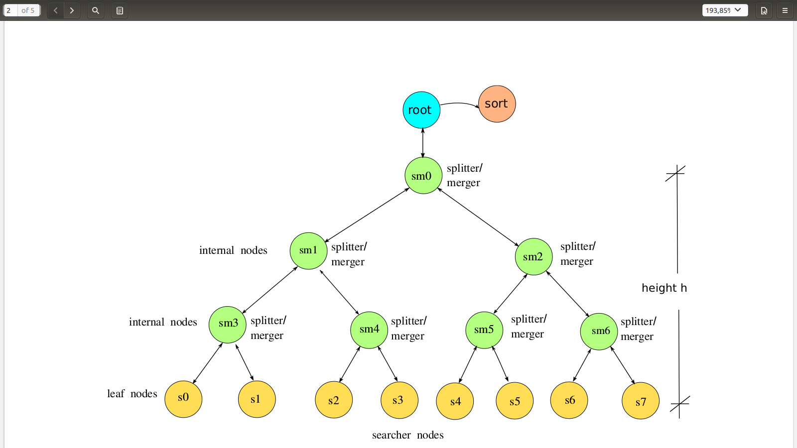

## Description
This is the 2nd project of the Operating Systems course. In this project, an initial(root) process creates new children processes using the **_fork()_** system call. The children processes produce an hierarchy of processes similar to a **binary tree**. 

The purpose of this project was to execute queries on binary files of fixed length records and to sort the results afterwards. Leaf nodes(**searcher processes**) are given the task of searching in specific parts of the binary file, whereas internal nodes(**splitter/merger processes**) merge the results retrieved from their children and "push" these results to their parents. After the search is concluded, the *sort()* system program performs, as its name indicates, the final sorting of the search results.

1. The **initial-root process** forks off the first splitter/merger process(**_sm0_**) passing to it the necessary arguments: height of the remaining tree, the binary datafile, the requested pattern of the search etc. When the query has been executed and the root has gathered all the search results, it uses the *sort()* system program to sort these results. In addition, the root process prints out time statistics related to the execution time of the query.

 
