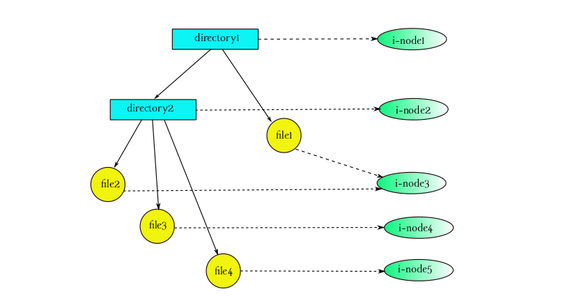

## Description
This is the final project of the Operating Systems course. In this project,  I developed the app *mirr*, an app that performs dynamic monitoring on an hierarchy of files and directories. When a modification occurs, the app updates the exact copy of the monitored hierarchy located in a backup folder. For this purpose, the Linux *inotify* system call interface is used.  

The inode (index node) is a data structure in the Linux operating system that describes a file-system object such as a file or a directory. Each inode is linked to the data of one and only file and stores all the information related to that file, except its filename (i.e i-node number, last modification date, size, etc). Therefore, each file is linked to a unique i-node, but an i-node can be linked to multiple filenames. This is achieved via hard links. In general, the logical structure of the Linux filesystem can be outlined by a acyclic directed graph (or a tree).

 

## Execution 

```


```
